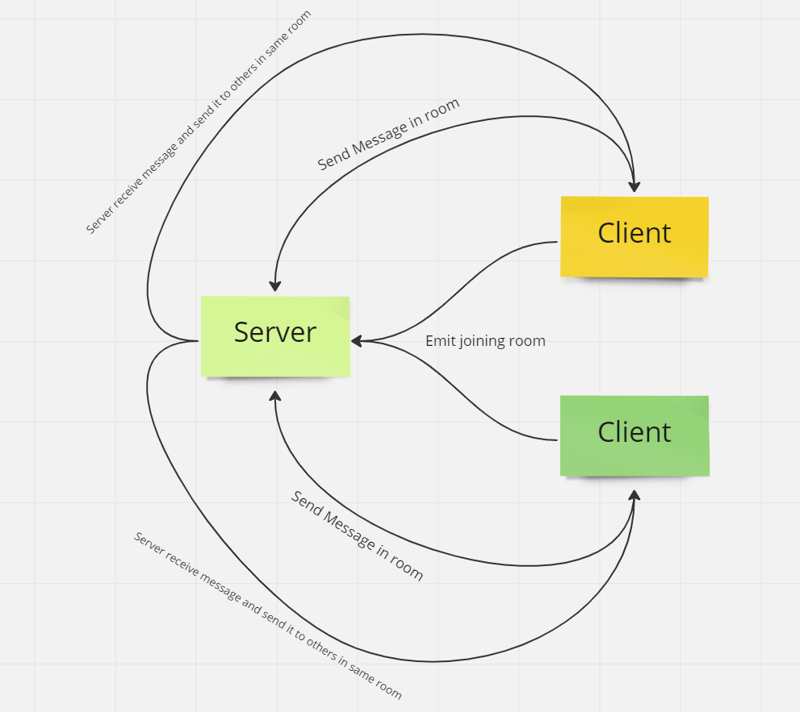

# chat-app

## How to start:
 open Back-end folder in one window and type npm start,  
 then open Front-end in another window and type npm start.

 ## Note:
  make sure to open front-end application twice to make 2 clients  and make sure to join same room!!,  
  then enjoy chating with each other :D 

## UML Diagram:

